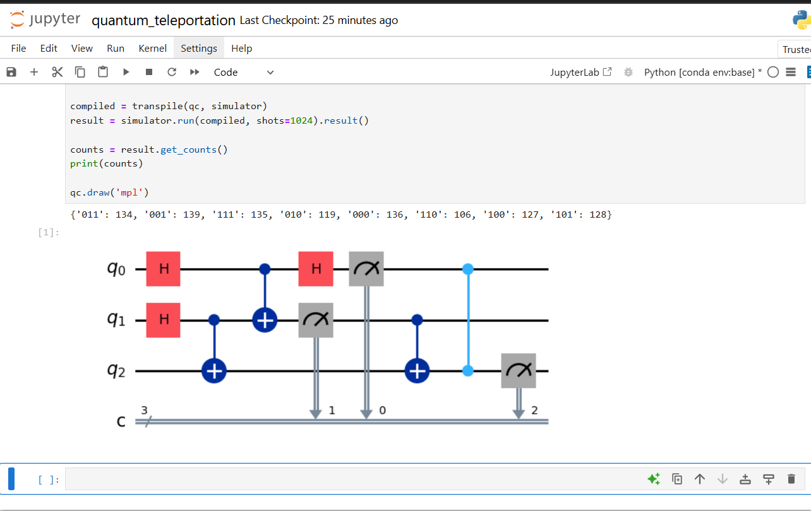

# Quantum Teleportation using Qiskit

🚀 Implemented using Qiskit Aer Simulator

## 📌 Description

This project demonstrates quantum teleportation using Qiskit. It shows how a quantum state can be transferred using entanglement and classical communication.

## 🧠 Concept

Quantum teleportation uses entanglement to transfer the state of one qubit to another without physically sending the qubit itself.

Steps:

1. Create entanglement between two qubits
2. Perform Bell measurement
3. Apply conditional operations
4. Recover original quantum state

## ⚙️ Tools Used

* Python
* Qiskit
* Jupyter Notebook

## 📊 Output

* State distribution obtained from Qiskit Aer simulator
* Circuit visualization included

## 🚀 How to Run

1. Install Qiskit:
   pip install qiskit qiskit-aer matplotlib pylatexenc

2. Run the notebook in Jupyter

## 📷 Results

